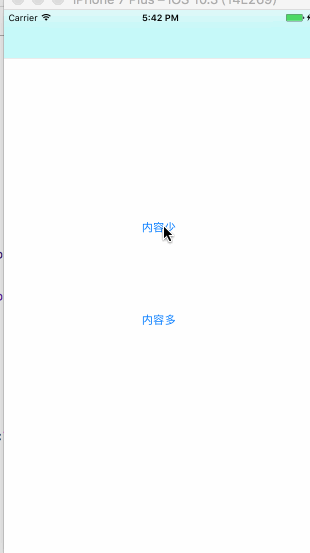

##落幕式用户提示

**效果图**

<p align="center">
    
</p>


##一句代码搞定

```
[MGTopTipView showTopTipContent:@"这是我的测试内容" toView:self.view.window]

```


## 落幕消失后执行代理
```

/**
 落幕消失后代理

 @param topTipView topTipView
 */
- (void)topTipViewDidAppear:(MGTopTipView *)topTipView;
```